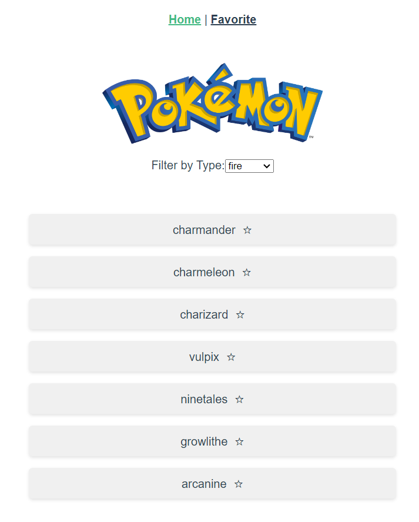
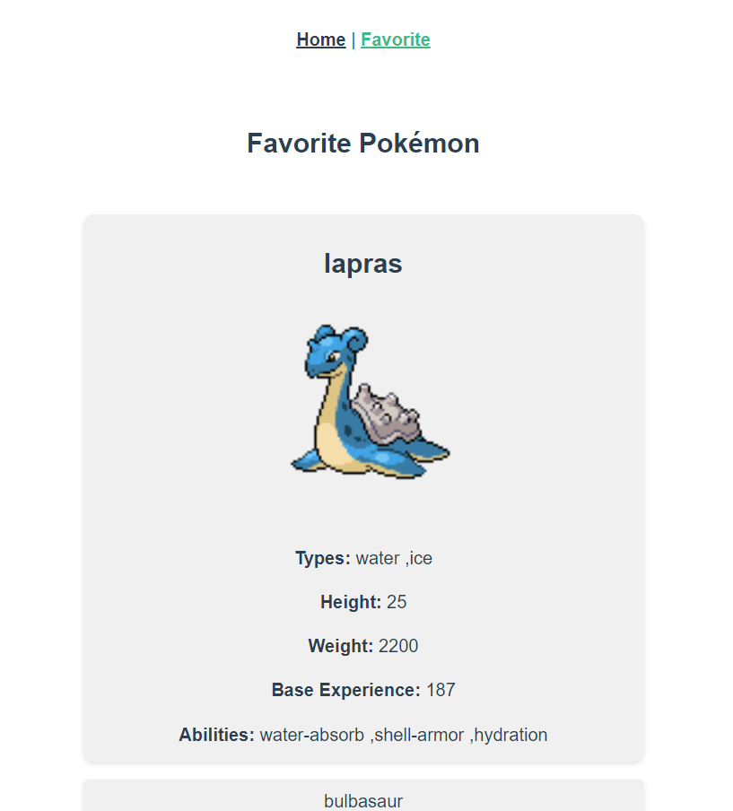

# pokodex-jublia

## Installation

```
1. Clone the repository: git clone https://github.com/arfanHA/pokedex.git
2. Navigate to the project directory: cd ./pokedex-jublia
3. Install dependencies: npm install
4. Customize the configuration: Modify the necessary files and configurations to suit your needs.
```

### Compiles and hot-reloads for development

```
1. Start the application: npm run serve
2. Access the application in a web browser at http://localhost:8080
```

### Compiles and minifies for production

```
npm run build
```

### Lints and fixes files

```
npm run lint
```

### Features

View all Pokemon by type using filters on top of page


Favourite certain Pokémon using a star icon and see the list of the favourited Pokémon on the 'Favorite' menu.

